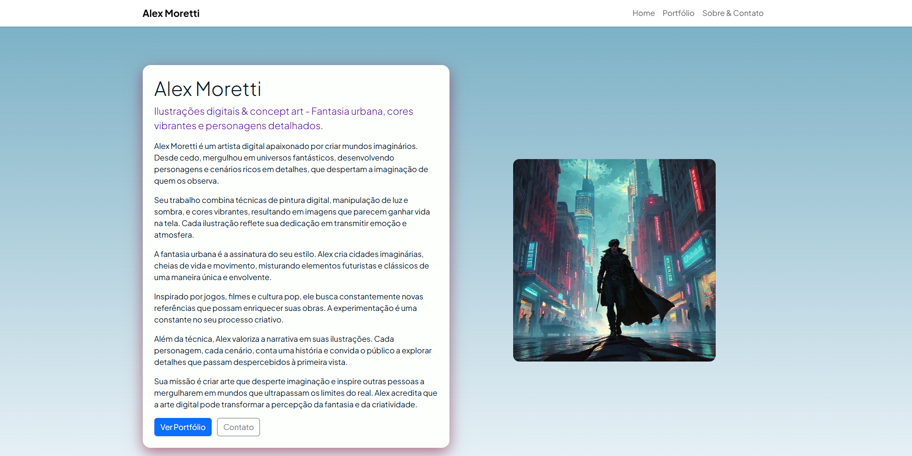

<div align="center">

# 🎨 [Portfólio - Alex Moretti](https://portfolio-alex-moretti.vercel.app/)
### Artista Digital & Criador de Mundos Imaginários



---


</div>

---

## 📌 Sobre o Projeto

Este é o portfólio oficial de **Alex Moretti**, um artista digital fictício especializado na criação de mundos imaginários, personagens e cenários que misturam fantasia, sci-fi e estética moderna.

O site foi desenvolvido como parte de um exercício de front-end, utilizando:

- **HTML5**
- **CSS3**
- **Bootstrap 5**
- **Layout One Page com Scroll Suave**
- **Cards do Bootstrap**
- **Formulário de Contato Responsivo**

---

## 🖥️ **Preview do Site**


---

## 🚀 Tecnologias Utilizadas

- **HTML5** - Estrutura semântica e moderna
- **CSS3** - Estilização visual customizada
- **Bootstrap 5** - Grid, cards e navbar responsiva
- **Google Fonts** - Melhor tipografia
- **Vercel** - Deploy simples e rápido

---

## 📚 Conteúdo do Site

### 🏠 Home / Apresentação
Seção com introdução ao artista, seu estilo, inspirações e missão criativa.

### 🖼️ Portfólio
Galeria com 6+ artes fictícias, apresentadas em **cards**.

### 📞 Sobre & Contato
História de Alex, áreas de interesse e um **formulário de contato funcional**.

---

## 🧠 Aprendizados deste projeto

Este projeto permitiu aplicar e reforçar conceitos essenciais de desenvolvimento front-end:

- Como estruturar e organizar um layout **One Page profissional**
- Uso eficiente do **Bootstrap Grid** para responsividade
- Construção de componentes visuais com **cards** e **navbar sticky**
- Melhores práticas de semântica HTML5
- Estilos consistentes com variáveis e classes utilitárias
- Deploy com **Vercel**
- Escrita de README profissional (este 😄)

---

## 📂 Como Rodar o Projeto

```
# Clone o repositório
git clone https://github.com/UelintonHJ/Portfolio-alex-moretti

# Entre na pasta
cd Portfolio-alex-moretti

# Abra o index.html
```

Não requer instalação de dependências, basta abrir no navegador!

---

## 🌐 Deploy

🔗 Acesse o site online:
https://portfolio-alex-moretti.vercel.app/

---

## 🤝 Contribuições

Este projeto é apenas para fins educacionais, mas sugestões são bem-vindas!

---
<div align="center">
Desenvolvido por **Uelinton Janke** - Front-End Developer.
</div>


