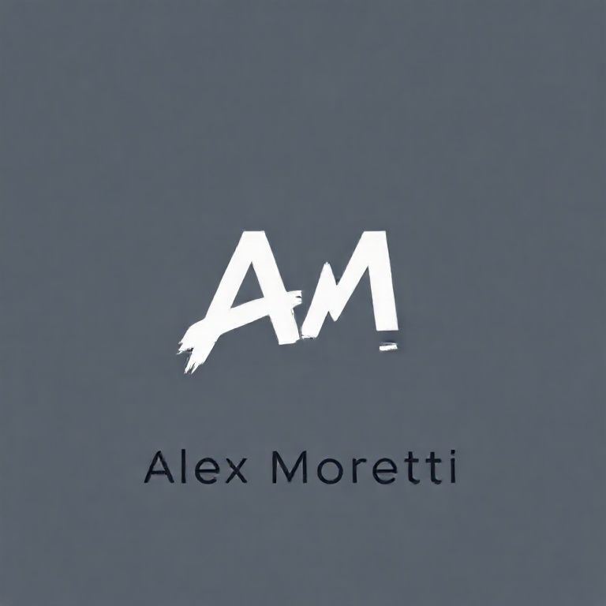

<div align="center">

# 🎨 [Portfólio - Alex Moretti](https://portfolio-alex-moretti.vercel.app/)
### Artista Digital & Criador de Mundos Imaginários


---


</div>

---

## 📌 Sobre o Projeto

Este é o portfólio oficial de **Alex Moretti**, um artista digital fictício especializado na criação de mundos imaginários, personagens e cenários que misturam fantasia, sci-fi e estética moderna.

O site foi desenvolvido como parte de um exercício de front-end, utilizando:

- **HTML5**
- **CSS3**
- **Bootstrap 5**
- **Layout One Page com Scroll Suave**
- **Cards e Carousel do Bootstrap**
- **Formulário de Contato Responsivo**

---

## 🖥️ **Preview do Site**


---

## 🧑‍🎨 Sobre o Artista (Fictício)



**Alex Moretti** é um artista digital que combina pintura digital, luz, sombra e cores vibrantes para criar mundos imaginários.
Seu estilo é marcado por fantasia urbana, personagens detalhados e atmosferas iluminadas por neon.

Criado exclusivamente para este projeto.

---

## 🖼️ Portfólio de Ilustrações

O site contém 7 obras:

- *Arte Destaque*
  


- *Guardião da Cidade*
  


- *Neon Runner*
  


- *Arquitetura Onírica*
  


- *Sentinela do Mercado*
  


- *Rooftop Memories*
  


- *Estúdio Noturno*
  


As imagens foram geradas por IA com prompts criados especialmente para este portfólio.

---

## ✨ Funcionalidades do Projeto

- Página inicial com apresentação do artista
- Galeria de portfólio em grade responsiva
- Imagens clicáveis com visualização ampliada (lightbox)
- Seção "Sobre & Contato" como formulário funcional (via `mailto:`)
- Navegação suave entre seções (`scroll-behavior: smooth`)
- Estrutura totalmente responsiva em todos os dispositivos

---

## 🌐 Visualização Online

https://portfolio-alex-moretti.vercel.app/

---

## 🛠️ Como executar localmente

```
git clone https://github.com/UelintonHJ/Portfolio-alex-moretti
cd Portfolio-alex-moretti
```

Depois é só abrir o arquivo index.html no navegador.

---

## 📬 Contato (Fictício)

* Instagram: **@alexmoretti.art**
* Behance: **/alexmoretti**
* Email: **alex.moretti@example.com**

---

## 📘 Linceça

Este projeto é de caráter **educacional**.
O artista, imagens e textos e identidade visual são 100% fictícios e criados apenas para fins de estudo.

---

## 👨‍💻 Autor

Desenvolvido por **Uelinton Janke** - Front-End Developer.
Se quiser trocar ideias sobre código, arte ou projetos, fique à vontade para entrar em contato!


